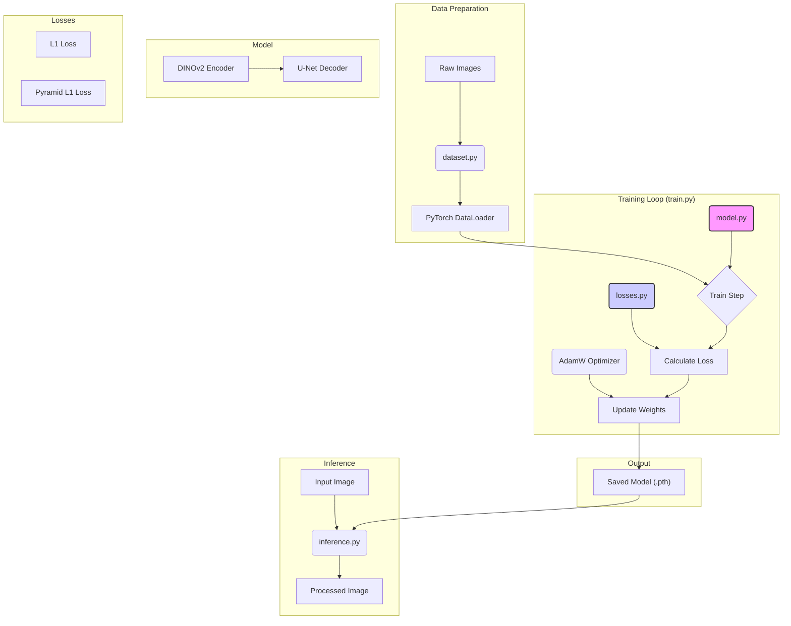

# Project Infrastructure & Workflow

```mermaid
graph TD
    subgraph "Data Preparation"
        A[Raw Images] --> B(dataset.py);
        B --> C[PyTorch DataLoader];
    end

    subgraph "Training Loop (train.py)"
        C --> D{Train Step};
        E(model.py) --> D;
        F(losses.py) --> G[Calculate Loss];
        H(AdamW Optimizer) --> I[Update Weights];
        D --> G;
        G --> I;
    end

    subgraph "Model"
        E_Unet["U-Net Decoder"]
        E_Dino["DINOv2 Encoder"]
        E_Dino --> E_Unet
    end

    subgraph "Losses"
        F_L1[L1 Loss]
        F_Pyr[Pyramid L1 Loss]
    end

    subgraph "Output"
        I --> J["Saved Model (.pth)"]
    end
    
    subgraph "Inference"
        K[Input Image] --> L(inference.py)
        J --> L
        L --> M[Processed Image]
    end

    style E fill:#f9f,stroke:#333,stroke-width:2px
    style F fill:#ccf,stroke:#333,stroke-width:2px
```
